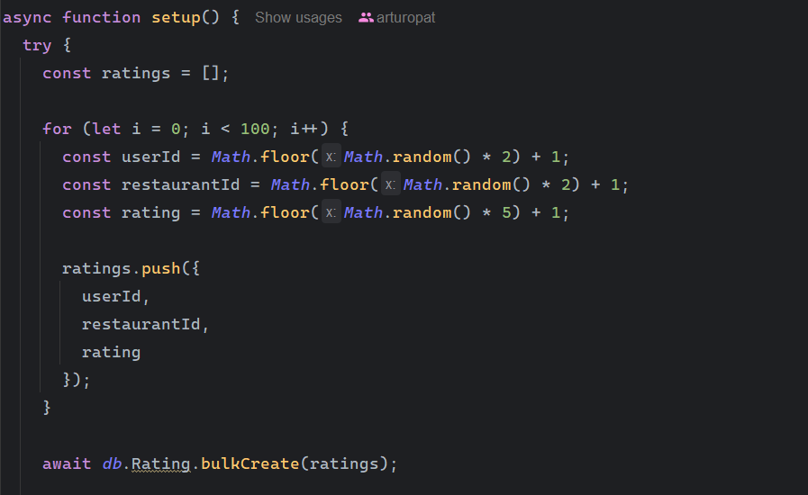

# Delivery api

## script to create data set

#### Setup script

Este script sirve para generar un conjutno de datos ficticios para simular la calificacion a un "negocio" de nuestra aplicacion.

Para ejecutar este comando puedes hacerlo de la siguiente manera:

```bash
  npm run setup
```
Esto añadira 100 registros para los restaurantes 1 y 2, el formato de calificacion para los negocios va del 1 al 5.



## Calificacion de los "negocios"

Para obtener la calificacion de los negocios se usa la misma ruta del home data

```http
  GET /api/v1/homedata
```

La respuesta del servidor sera la siguiente:


```json
{
  "categoria": {
    "id": 1,
    "image_url": "https://cdn-icons-png.flaticon.com/512/1198/1198307.png",
    "nombre": "Comida rapida",
    "createdAt": "2024-05-23T19:29:57.314Z",
    "updatedAt": "2024-05-23T19:29:57.314Z"
  },
  "productosMasBaratos": [],
  "RecientementeAgregados": [],
  "nuevosProductos": [],
  "losMejoresCalificados": [
    {
      "restaurantId": 1,
      "averageRating": "2.0000000000000000",
      "restaurantDetails": {
        "id": 1,
        "name": "Super pizza2",
        "description": "Descripcion super pizza",
        "address": "Aqui algun lugar de tizimin",
        "email": "superpizza2@gmail.com",
        "password": "$2a$15$o5X7wc8SyprIYdep26lSGeytV5xXABxxWXDRz/Q1lpOwe39kQ9s4u",
        "phone": "8743874837161",
        "entrega": "Fast delivery",
        "envio": "Free",
        "perfil_url": "https://cdn.pixabay.com/photo/2015/10/05/22/37/blank-profile-picture-973460_960_720.png",
        "cover_url": "https://www.wyzowl.com/wp-content/uploads/2021/04/YouTube-banner-ideas.png",
        "createdAt": "2024-05-23T19:30:06.469Z",
        "updatedAt": "2024-05-23T19:30:06.469Z",
        "categoriaId": 1
      }
    },
    {
      "restaurantId": 2,
      "averageRating": "3.0000000000000000",
      "restaurantDetails": {
        "id": 2,
        "name": "Super pizza3",
        "description": "Descripcion super pizza",
        "address": "Aqui algun lugar de tizimin",
        "email": "superpizza3@gmail.com",
        "password": "$2a$15$EMeWOC5mqz./hBOeUgN5zO.z7TVjrc1UbC6gKxhKur1juapYrqufu",
        "phone": "8743874837162",
        "entrega": "Fast delivery",
        "envio": "Free",
        "perfil_url": "https://cdn.pixabay.com/photo/2015/10/05/22/37/blank-profile-picture-973460_960_720.png",
        "cover_url": "https://www.wyzowl.com/wp-content/uploads/2021/04/YouTube-banner-ideas.png",
        "createdAt": "2024-05-23T19:30:14.408Z",
        "updatedAt": "2024-05-23T19:30:14.408Z",
        "categoriaId": 1
      }
    }
  ]
}
```


El objeto que contendra la informacion de las calificaciones es el objeto losMejoresCalificados

## Pantalla principal

#### obtener informacion para la pantalla principal

Para la pantalla principal se tiene los siguientes endpoints

#### Obtener todos los titulos e imagenes

```http
  GET /api/v1/getAllmainScreen
```

#### Añadir nuevo registro

```http
  POST /api/v1/addMainScreenData
```

#### Obtener un unico registro

```http
  GET /api/v1/getMainScreen/:id
```

#### Actualizar un registro

```http
  PUT /api/v1/updateMainScreen/:id
```

#### Borrar un registro

```http
  DELETE /api/v1/deleteMainScreen/:id
```

## Registro e inicio de sesion

#### Realizar el registro y autenticacion de los usuarios

Para el inicio de sesion y registro de los usuarios se tiene los siguientes endpoints

#### Registrar un usuario

```http
  POST /api/v1/sign-up
```

Para el registro de un usuario se requiere la siguiente informacion:

**name**

**lastname**

**email**

**password**

**phoneNumber**

**birthdayDate**

**gender**

**profileUrl**

La contraseña debe contener minimo 6 caracteres, una letra mayuscula, una letra minuscula, y un simbolo, todos los campos deben ser proporcionados igualmente.

#### Inicio de sesion usuarios

```http
  POST /api/v1/sign-in
```

Para el inicio de sesion de un usuario se necesita del correo y contraseña

Si el inicio de sesion es correcto al usuario se le proporciona el TOKEN de acceso

## Perfil del usuario

#### Validacion del usuario y entrega de la informacion

Para que un usuario pueda ver su perfil se necesita comprobar que cuenta con el token que se le proporciono al iniciar sesion.

#### Perfil del usuario

```http
  GET /api/v1/profile
```

Si la verificacion del token y acceso son correctos se le devuelve la siguiente informacion al usuario:

**name**

**lastname**

**email**

**password**

**phoneNumber**

**birthdayDate**

**gender**

**profileUrl**

**role**

#### Actualizar perfil del usuario

```http
  PUT /api/v1/profile/:id
```

Si la verificacion del token y acceso son correctos se le permite al usuarios actualizar los siguientes campos:

**name**

**lastname**

**email**

**password**

**phoneNumber**

**birthdayDate**

**gender**

**profileUrl**

**role**

#### Borrar perfil del usuario

```http
  DELETE /api/v1/profile/:id
```

Al borrar el usuario el servidor retorna el mensaje "Se ha eliminado con exito la cuenta" por lo que se debe borrar toda la informacion tanto del cliente y servidor y retornar al usuario al registro o inicio de sesion.

## Direcciones del usuario

#### Registro,actualizacion,obtencion y borrado de las direcciones del usuario

El usuario puede registrar multiples direcciones asi como borrar obtener y actualizar las mismas.

#### Obtener todas las direcciones de un usuario

```http
  GET /api/v1/getUserAddress/:id
```

Para obtener las direcciones de un usuario se necesita el id del usuario, pasandole el dato obtendra todas las direcciones.

#### Añadir direccion de usuario

```http
  POST /api/v1/addUserAddress/:id
```

Al igual que lo anterior para registrar la direccion de un nuevo usuario se requiere la ruta y el id.

#### Actualizar las direcciones de un usuario

```http
  PUT /api/v1/updateUserAddress/:userId/address/:idAddress
```

Para actualizar la direccion de un usuario se requiere pasar el id del usuario y el id de la direccion que se quiere actualizar.

#### Borrar las direcciones de un usuario

```http
  DELETE /api/v1/deleteUserAddress/:userId/address/:idAddress
```

Para el borrado de una direccion es lo mismo que el actualizar.

## Perfil restaurante

#### Obtener, actualizar y borrar perfil del restaurante

Al igual que los usuarios el restaurante puede actualizar su informacion, en cuanto a validaciones los restaurantes no pueden poner nombres, correos y telefonos ya registrados.

#### Obtener el perfil del restaurante

```http
  GET /api/v1/restaurantProfile
```

Para poder obtener la informacion del restaurante se necesita verificar que tenga un token en el Authorization.

La informacion que se mostrara en el perfil del restaurante es lo siguiente:

**id**

**name**

**description**

**address**

**email**

**password**

**phone**

**entrega**

**envio**

**perfil_url**

**cover_url**

#### Actualizar informacion del restaurante

```http
  PUT /api/v1/restaurantProfile/:id
```

En caso de intentar actualizar con algun nombre,correo o telefono que ya existe se devolvera un error al cliente. Todos los campos se pueden modificar sin excepcion.

#### Borrar el restaurante

```http
  DELETE /api/v1/restaurantProfile/:id
```

## Buscador general

#### Buscar información

Ruta que permite la busqueda de productos de manera general

```http
    GET /api/v1/searchGlobal
```

Para la busqueda global requieres hacer uso de lo siguiente: http://localhost:3000/api/v1/searchGlobal?searchTerm=pizza, search term debe ser agregado al frontend con el ? operador seguido del termino a buscar.

## Buscador interno restaurant

#### Busqueda por restaurant

Ruta que permite realizar busqueda de productos de manera interna en un restaurant

```http
    GET /api/v1/searchRestaurante?searchTerm=prueba&restaurantId=1
```

Para la busqueda de manera interna hacer uso de lo siguiente: http://localhost:3000/api/v1/searchRestaurante?searchTerm=prueba&restaurantId=1, searchRestaurante debe ser agregado al frontend con el ? operador seguido del termino a buscar. La palabra "prueba" es el termino de busqueda.

## Compra

#### Realizar compra

Para realizar una compra se requiere mandar un objeto de la siguiente forma: 

```json
{
  "direccion_entrega": "calle 20 entre 28 y 40",
  "items": [
    {
      "productId": 1,
      "cantidad": 2,
      "precio_unitario": 28
    },
    {
      "productId": 6,
      "cantidad": 5,
      "precio_unitario": 47
    },
    {
      "productId": 4,
      "cantidad": 2,
      "precio_unitario": 12
    },
    {
      "productId": 8,
      "cantidad": 2,
      "precio_unitario": 54
    },
    {
      "productId": 12,
      "cantidad": 3,
      "precio_unitario": 78
    }
  ]
}
```

## Subcategoria por categoria

#### Añadir y obtener las categorias de una determinada categoria

Las categorias tienden a tener subcategorias, para añadir estas usa la ruta:

```http
    POST /api/v1/addSubcategorias
```

La informacion necesaria para añadir una subcategoría es la siguiente:

```json
{
  "categoriaId": "1", "nombre": "Postre", "image_url": "https://cdn-icons-png.flaticon.com/128/11590/11590622.png"
}
```

Para obtener las subcategorias de una categoria usa la siguiente ruta:

```http
    POST /getSubcategorias/:id
```

## Terminos y condiciones

#### Obtener, actualizar y borrar los terminos y condiciones

En el cuerpo del metodo se envia el content

#### Obtener los terminos y condiciones

```http
  GET /api/v1/terminosYCondiciones
```

#### Añadir los terminos y condiciones

```http
  POST /api/v1/addterminosycondiciones
```

#### Actualizar los terminos y condiciones

```http
  PUT /api/v1/actualizarterminosycondiciones
```

1. **Terminos y condiciones**: Para poder actuaizar los terminos y condiciones se debe enviar el contenido, ejemplo:

```json
{
  "content": "Terminos y condiciones"
}
```

#### Borrar los terminos y condiciones

```http
  DELETE /api/v1/eliminarterminosycondiciones
```

1. **Terminos y condiciones**: Para poder borrar los terminos y condiciones se debe enviar el contenido, ejemplo:

```json
{
  "content": "Terminos y condiciones"
}
```
